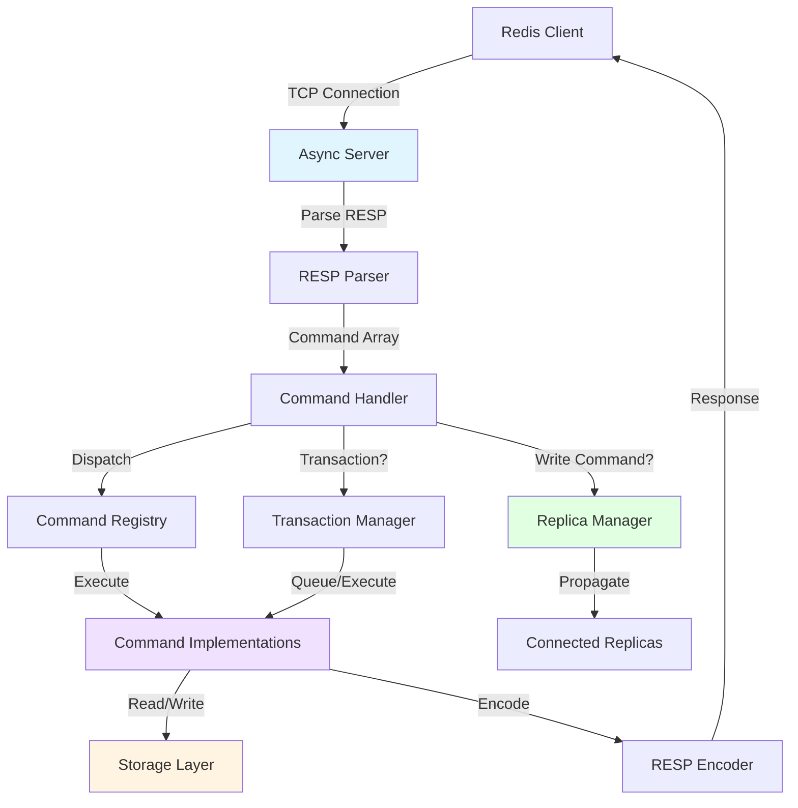
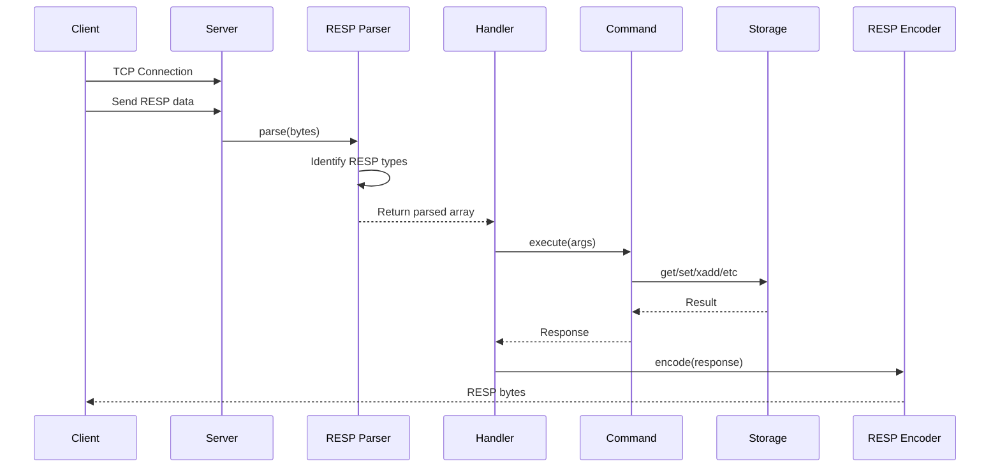
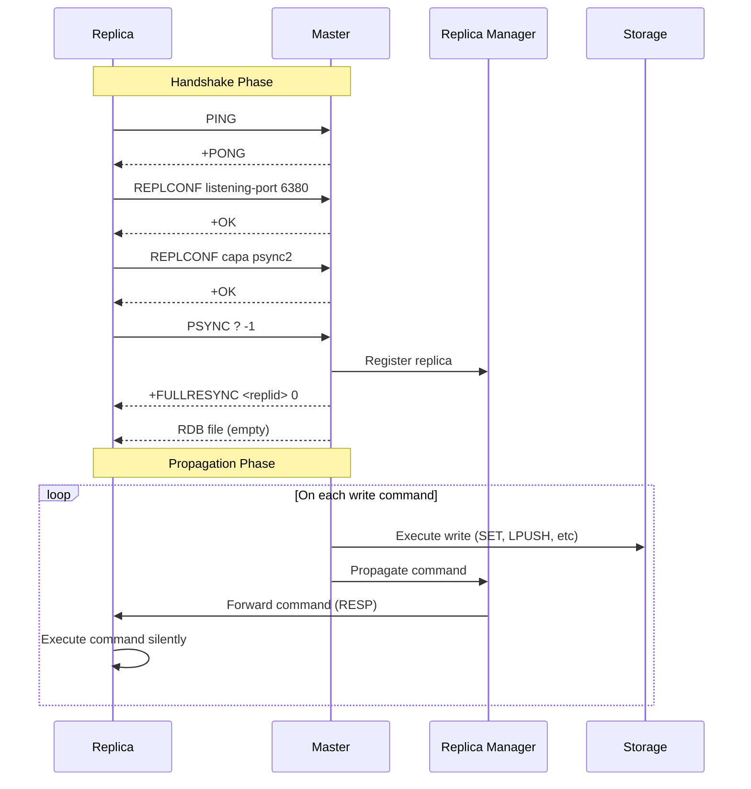
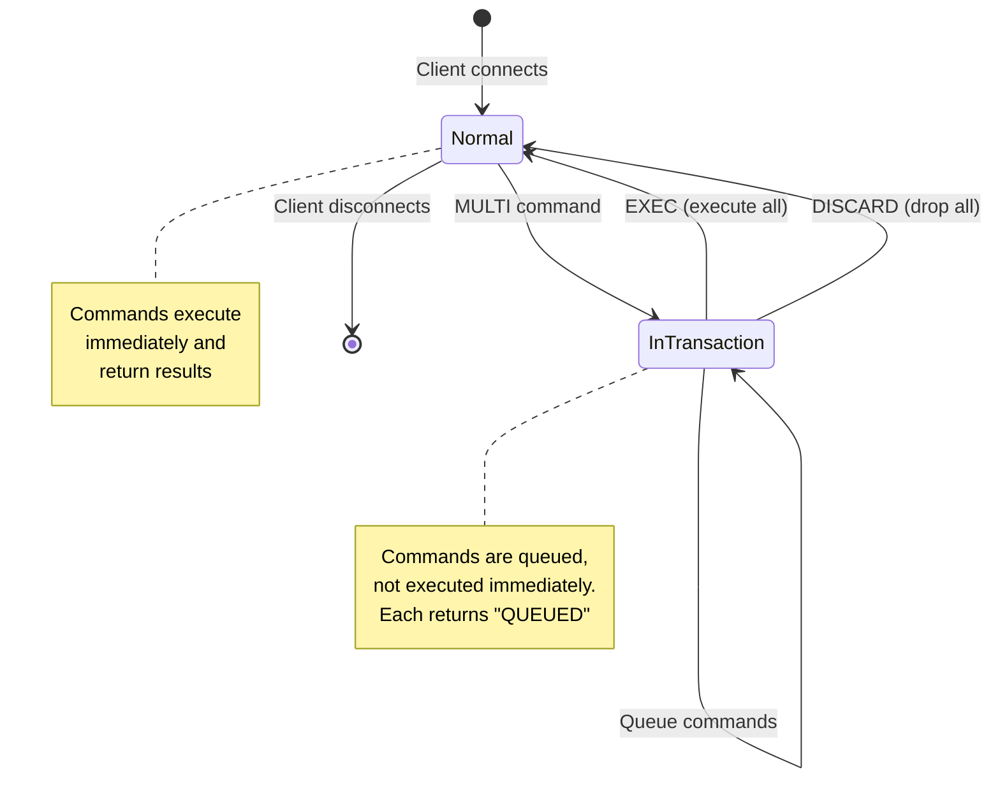
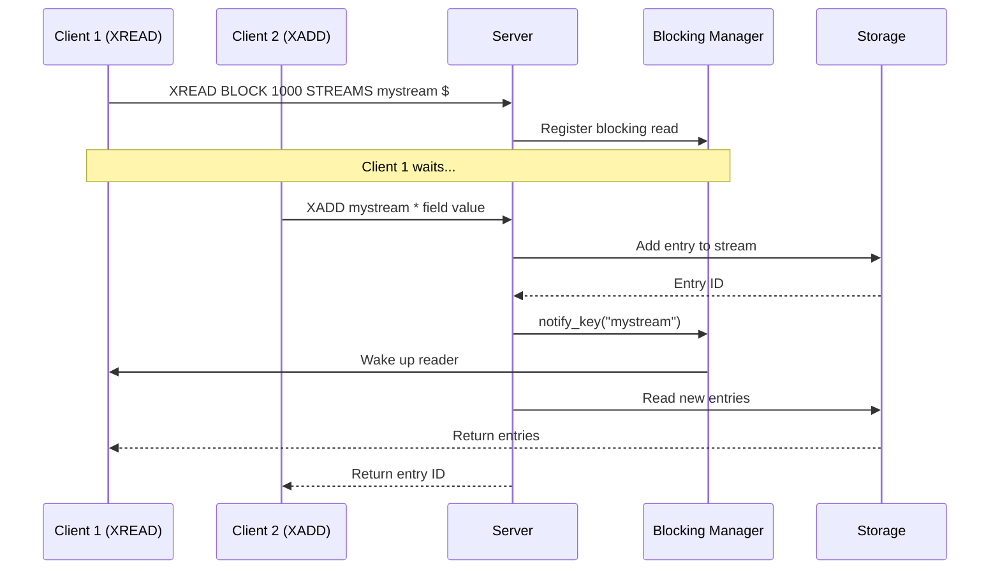
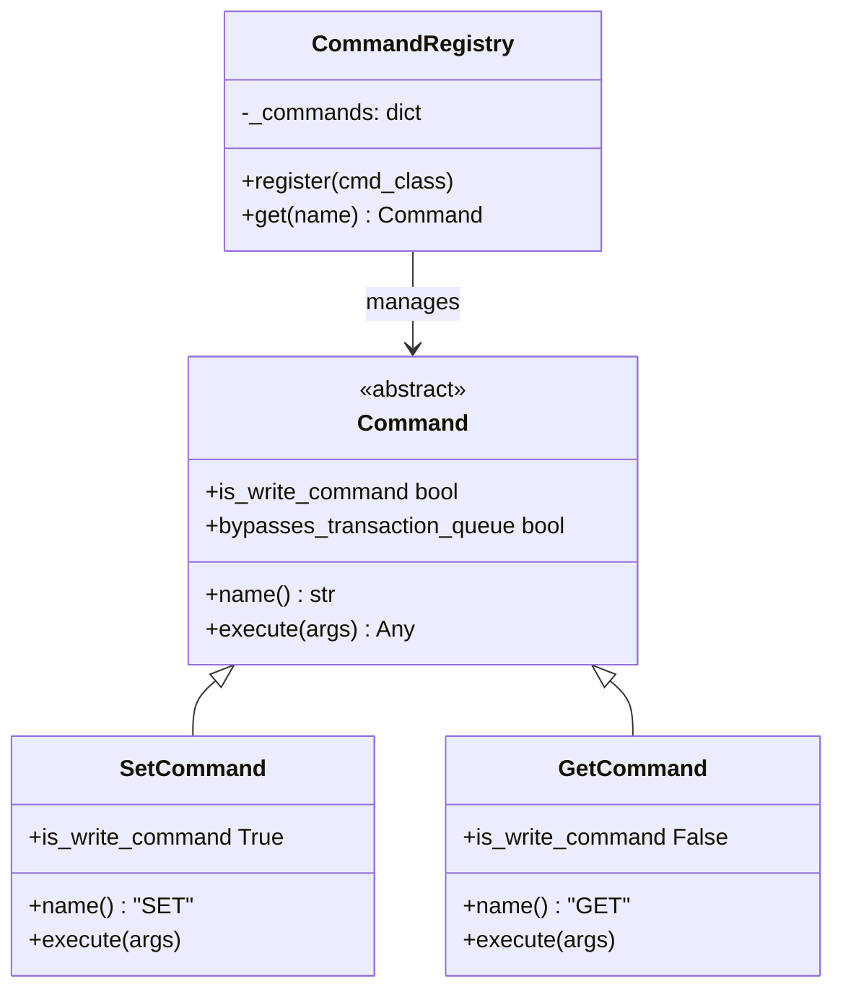
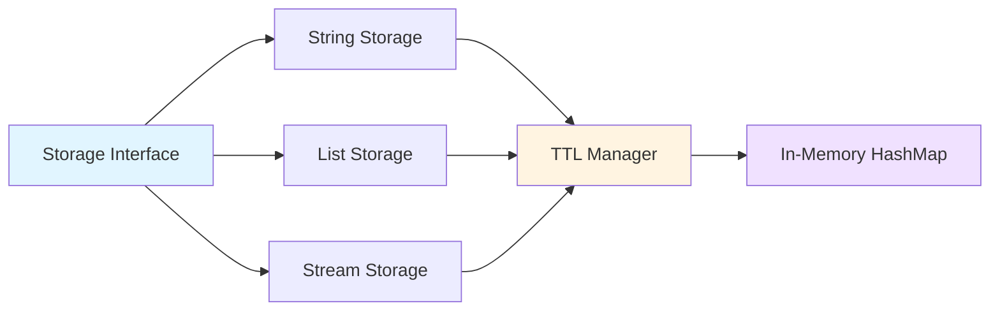

# Architecture Overview

This document provides a deep dive into PyRedis's architecture, design decisions, and internal workings.

## 📐 High-Level Architecture



## 🔄 Request Flow

### 1. Client Connection & Command Processing



### 2. Master-Replica Replication Flow



### 3. Transaction Execution (MULTI/EXEC)



### 4. Streams with Blocking Reads (XREAD BLOCK)



## 🏗️ Core Components

### RESP Protocol Layer

The RESP (Redis Serialization Protocol) implementation is the foundation:

```python
# Parser: Bytes → Python Objects
RESPParser.parse(b"*2\r\n$4\r\nECHO\r\n$5\r\nhello\r\n")
# → ['ECHO', 'hello']

# Encoder: Python Objects → Bytes
RESPEncoder.encode("hello")  # → b'$5\r\nhello\r\n'
RESPEncoder.encode(42)       # → b':42\r\n'
RESPEncoder.encode(None)     # → b'$-1\r\n'
```

**Key Design Decisions:**
- **Stateless**: Each parse/encode is independent
- **Recursive**: Handles nested arrays naturally
- **Type mapping**: Automatic Python ↔ RESP type conversion

### Command Registry Pattern

Commands are self-registering through metaclass magic:



Benefits:
- **Easy to extend**: Add new command = create new file
- **Type safe**: Base class enforces interface
- **Testable**: Each command is isolated

### Storage Layer



**Features:**
- **Type-aware**: Different operations for strings, lists, streams
- **TTL support**: Automatic expiration using timestamps
- **Stream IDs**: Auto-generation with millisecond precision

### Async I/O Architecture

```python
# Single event loop handles all connections
async def main():
    server = await asyncio.start_server(
        handle_client,
        host="localhost",
        port=6379
    )
    async with server:
        await server.serve_forever()

# Each client gets a coroutine
async def handle_client(reader, writer):
    while True:
        data = await reader.read(1024)  # Non-blocking
        response = await execute_command(...)  # May block internally
        writer.write(response)
        await writer.drain()  # Non-blocking
```

**Why asyncio?**
- ✅ Single thread handles thousands of connections
- ✅ No race conditions (cooperative multitasking)
- ✅ Perfect for I/O-bound workloads like Redis
- ✅ Built-in timeout and cancellation support

## 📊 Data Structures

### Stream Entry Storage

Streams are the most complex data structure:

```python
{
    "mystream": StreamData(
        entries=[
            StreamEntry(
                id="1234567890-0",
                fields={"temperature": "20", "humidity": "65"}
            ),
            StreamEntry(
                id="1234567890-1", 
                fields={"temperature": "21", "humidity": "64"}
            )
        ],
        last_id="1234567890-1"
    )
}
```

**ID Format:** `<milliseconds>-<sequence>`
- Monotonically increasing
- Supports range queries
- Enables auto-generation

### Blocking Operations

```python
# Blocking registry maps keys to waiting clients
{
    "mystream": [
        BlockingRead(
            reader=<StreamReader>,
            writer=<StreamWriter>,
            timeout=asyncio.create_task(...),
            trigger_count=1
        )
    ]
}
```

When `XADD` occurs:
1. Add entry to storage
2. Check blocking registry
3. Wake up waiting readers
4. Cancel their timeout tasks

## 🔐 Security Considerations

Currently implemented:
- ✅ Input validation (command arguments)
- ✅ RESP protocol validation
- ✅ Type checking for all operations

**Not yet implemented:**
- ❌ Authentication (ACL)
- ❌ TLS/SSL encryption
- ❌ Resource limits (max connections, memory)

## 🚀 Performance Characteristics

| Operation | Time Complexity | Notes |
|-----------|----------------|-------|
| `SET` | O(1) | Hash table insert |
| `GET` | O(1) | Hash table lookup |
| `LPUSH/RPUSH` | O(1) | Deque append |
| `LRANGE` | O(S+N) | S: start offset, N: range size |
| `XADD` | O(1) | Append + ID generation |
| `XRANGE` | O(N) | N: matching entries |
| `XREAD BLOCK` | O(1) | Registration, O(N) on wake |

**Memory:**
- All data in-memory (no disk persistence yet)
- TTL cleanup on access (lazy eviction)
- No memory limits enforced


## 📚 Learning Resources

This implementation demonstrates:

1. **Protocol Design**: How Redis's RESP protocol enables efficient client-server communication
2. **Async I/O**: Using Python's asyncio for high-concurrency network services
3. **Distributed Systems**: Master-replica replication, eventual consistency
4. **Data Structures**: Efficient in-memory storage with TTL
5. **Command Pattern**: Extensible architecture for adding features
6. **Testing**: Unit and integration testing for complex systems

## 🤝 Contributing

See [CONTRIBUTING.md](../CONTRIBUTING.md) for details on:
- Adding new commands
- Improving performance
- Extending storage layer
- Adding new data types

---

**Built with ❤️ to teach Redis internals and async Python**
